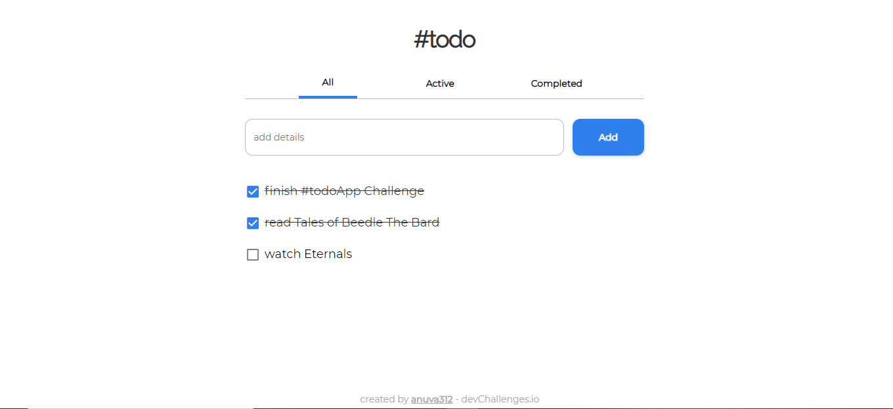
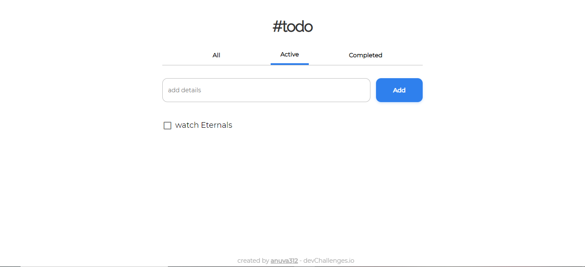
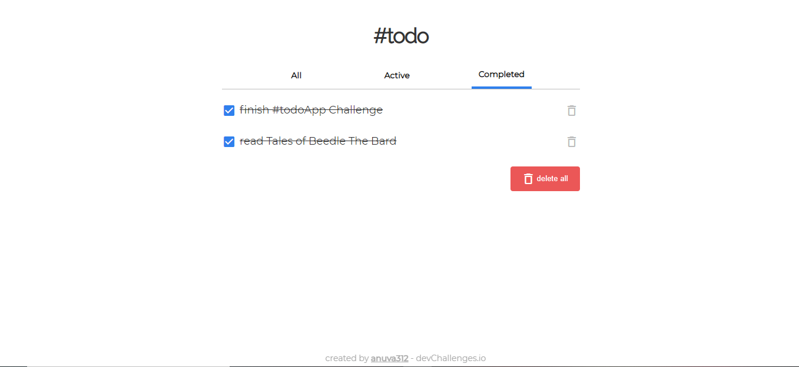
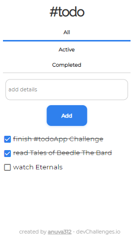

# ToDoApp

An Application created as a solution for the [ToDoApp Challenge](https://legacy.devchallenges.io/challenges/hH6PbOHBdPm6otzw2De5) from [Devchallenges.io](https://legacy.devchallenges.io).

<!-- TABLE OF CONTENTS -->

## Table of Contents

- [Challenge](#challenge)
- [Solution](#solution)
  - [Demo](#demo)
  - [Demo Screenshots](#demo-screenshots)
  - [Built With](#built-with)
- [How to Use](#how-to-use)

<!-- Challenge -->

## Challenge

Create a todo app following the given designs. Use Front-end libraries like React or Vue.

Fulfill user stories below:

- User story: I can add a new task
- User story: I can complete a task
- User story: I can toggle between All, Active and Completed
- User story: I can remove one or all tasks under the Completed tab
- User story (optional): Store the data in local storage that when I refresh the page I can still see my progress

## Solution

### Demo

Find the site in action [here](https://brave-bassi-231eac.netlify.app/)!

### Demo Screenshots

Home Page



Active



Completed



Mobile View



### Note:

- Stores the data on local storage so that progress is retained on refresh
- Initially no tasks will be found, start adding tasks to use the App
- The "delete all" button will only be visible if completed tasks are present

### Built With

<!-- This section should list any major frameworks that you built your project using. Here are a few examples.-->

- [React](https://reactjs.org/)

## How To Use

<!-- For example: -->

To clone and run this application, you'll need [Git](https://git-scm.com) and [yarn](https://yarnpkg.com/). From your command line:

```bash
# Clone this repository
$ git clone https://github.com/anuva312/ToDoApp-devChallenges

# Install dependencies
$ yarn install

# Run the app
$ yarn start
```
